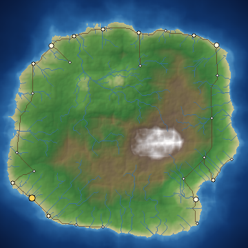

# Cartogenesis

**A deterministic, dependency-free procedural world generation engine.**

Cartogenesis turns a single seed into a whole world — **elevation, oceans and
lakes, temperature, rainfall, rivers, and biomes today**; regions, settlements,
and history over time. Same seed, same world, forever, on any machine. It has
**zero runtime dependencies** and runs directly on modern Node.js with no build
step.



> *The canonical world, seed `cartogenesis`.*

---

## Why this project exists

This is a long-running, self-directed build. Each work session adds a real,
tested layer to a world simulation that compounds: elevation is the foundation,
and every later system (water flow, temperature, rainfall, ecosystems, cultures)
builds on the layers beneath it. The constraints are deliberate:

- **Deterministic.** A world is a pure function of its seed and config. This is
  enforced by a golden-hash test, so regressions in the generator are caught.
- **Zero dependencies.** No npm install, no supply chain, no bit-rot. If you have
  Node ≥ 22.6, you can run everything here.
- **Reproducible.** Named RNG sub-streams mean new subsystems can be added
  without changing the output of existing ones.

## Quick start

Requires **Node.js ≥ 22.6** (for native TypeScript execution). No install step.

```bash
# Generate a world (writes PNG maps + JSON metadata to ./output)
node src/cli.ts generate --seed "my-world"

# Options
node src/cli.ts generate \
  --seed "atlas" \
  --width 512 --height 512 \
  --sea-level 0.42 \
  --octaves 6 \
  --out output

# Run the test suite (34+ tests, all offline, all deterministic)
npm test

# Regenerate the sample gallery under docs/
node scripts/make-samples.ts
```

Each `generate` run writes three files:

| File | Contents |
|------|----------|
| `<name>.map.png` | Hypsometric-tinted, hill-shaded terrain map with rivers |
| `<name>.biome.png` | Biome atlas (16 biomes) with rivers |
| `<name>.height.png` | Raw grayscale elevation (heightmap) |
| `<name>.json` | World metadata, including a determinism `contentHash` |

## The gallery

`docs/index.html` is a static, self-contained viewer for the committed sample
worlds. It's designed to be served by **GitHub Pages** (from the `/docs`
folder). Open it locally by serving the folder, or enable Pages to publish it.

## Architecture

The engine is a pipeline of small, single-purpose modules. See
[`ARCHITECTURE.md`](ARCHITECTURE.md) for the full map. In short:

```
seed ──► Rng ──► named sub-streams ──► subsystems ──► World
                                        (terrain, …)     │
                                                         ├─► render ─► PNG
                                                         └─► metadata ─► JSON
```

| Module | Responsibility |
|--------|----------------|
| `src/rng.ts` | Deterministic PRNG + independent named streams |
| `src/noise.ts` | Value noise, fBm, ridged multifractal |
| `src/grid.ts` | Shared 2D scalar-field type |
| `src/terrain.ts` | Elevation generation (L1) |
| `src/hydrology.ts` | Oceans, lakes, coasts, distance-to-ocean (L2) |
| `src/climate.ts` | Temperature + moisture fields (L3, L4) |
| `src/rivers.ts` | Priority-Flood drainage + rivers (L5) |
| `src/biomes.ts` | Whittaker biome classification (L6) |
| `src/render.ts` | Grids/layers → RGBA (terrain, biome, climate, rivers) |
| `src/png.ts` | Dependency-free PNG encoder |
| `src/world.ts` | Orchestration, metadata, content hashing |
| `src/cli.ts` | Command-line interface |

## Project continuity

This repository is built to be picked up and continued across many independent
sessions. The source of truth for status lives in four files:

- **[`PROJECT_STATE.md`](PROJECT_STATE.md)** — current status at a glance.
- **[`ROADMAP.md`](ROADMAP.md)** — where this is going (1 day → 6 months).
- **[`DECISIONS.md`](DECISIONS.md)** — major decisions and their reasoning.
- **[`CHANGELOG.md`](CHANGELOG.md)** — what each session produced.
- **[`NEXT_SESSION.md`](NEXT_SESSION.md)** — the exact next task to pick up.

## License

MIT — see [`LICENSE`](LICENSE).
